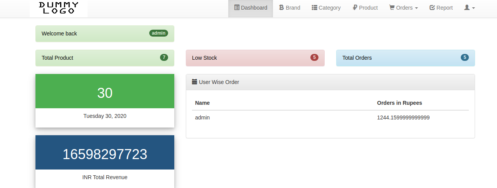
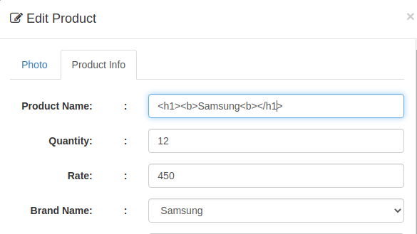
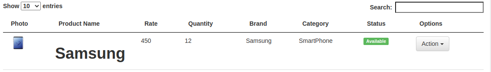

# SecurityTesting
This repository contains the reports of some of the exercises and project done in my Security course. 
In this course we explored the OWASP top ten web application security vulnerabities in systems and wep applications. We exploited and added relevant patches where necessary. We used tools like OWASP Zap, explored web automation framweworks like selenium and static taint analysis on codes. 
Some of the reports found in this repo are reports on attacks and exploitation like Buffer Overflow, Integer overflow, Sql Injection, XSS, XSRF. It also includes test automation using Selenium with Java to automate True positive vulnerabilities found on a web app. 
For the XRSF attack go to: https://medium.com/@evidencemonday/webgoat-cross-site-request-forgery-solution-1c069985e80f  
The project for this course was on finding, exploiting vulnerabilty in an inventory management system web application, performing static analysis on the code and patching the vulnerabities. 

  
  

